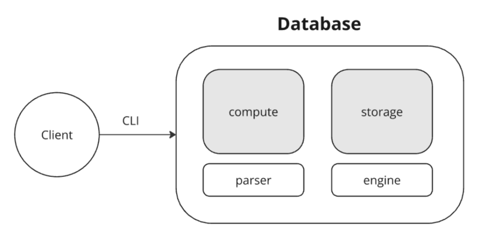

# in-memory-key-value-db 🧠⚡️

## Минималистичное in-memory KV-хранилище. Поддерживает команды SET, GET, DEL (строго ВЕРХНИЙ РЕГИСТР).

### Запуск
```bash
go run cmd/main.go
```

### Примеры команд:

> SET key value — сохранить
> GET key — вывести
> DEL key — удалить

### Аргументы соответствуют:

> ^[A-Za-z0-9_/*]+$

Разделители — любые пробельные символы.

### Структура проекта:



```
internal/
  app/
    parser/    # компонент внутри слоя, отвечающий за парсинг запросов
    compute/   # слой, отвечающий за обработку запроса
    pipline/   # агрегирующий слой
  storage/     # слой, отвечающий за хранение и обработку данных
    engine/    # компонент внутри слоя, отвечающий за то, где и как хранятся данные
```
